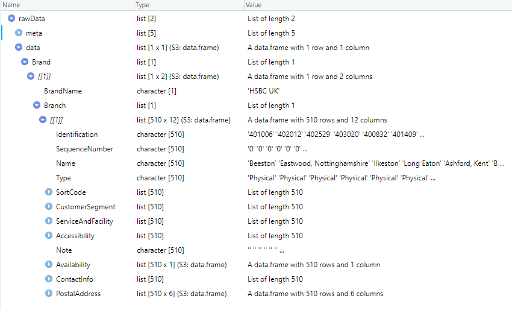

```{r setup, include = FALSE}
knitr::opts_chunk$set(
  collapse = TRUE,
  comment = "#>"
)
```


## Functions

| Function       | Description                | Input | Output             |
| ------------- |----------------------|----------------------|-------------------|
| CreateOpenBankingClient | Creates a client for calling the API | Optional user-defined settings | OpenBankingClient object with query functions |


## Create an API client
Create a new client for querying the API
```{r, eval = FALSE}
library(openbankeR)

openBankingClient <- openbankeR::CreateOpenBankingClient()
```


## Bank Details
```{r, eval = FALSE}
bankDetails <- openBankingClient$BankDetails

View(bankDetails)
```


## Available banks
Get a list of banks that report the API
```{r, eval = FALSE}
availableBanks <- openBankingClient$GetAvailableBanks()

availableBanks
```


## Available instruments
Get a list of instruments reported via the API
```{r, eval = FALSE}
availableInstruments <- openBankingClient$GetAvailableInstruments()

availableInstruments
```


## Extract raw data
Get raw data using the API for a given bank and instrument
```{r, eval = FALSE}
bankName <- "HSBC Group"
instrument <- "branches"

rawData <- openBankingClient$GetRawData(
  bankName = bankName,
  instrument = instrument
)

rawData
```




## Additional help
Use the below commands to find additional documentation about the package
```R
??openbankeR

??openbankeR::CreateOpenBankingClient
```


## Note
Raw data provided by the API can be a nested structure and may need to be unnested for some types of analysis.
